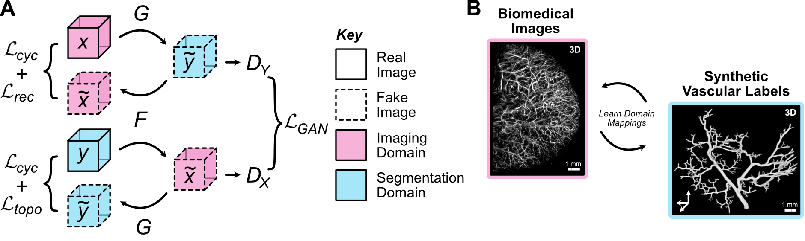

# VAN-GAN: An Unsupervised Deep Learning Tool for Vascular Network Segmentation

***VAN-GAN offers an accessible and efficient solution for the segmentation of vascular networks from 3D images without the need for human-annotated labels.***

## Introduction

Recent advancements in imaging hardware have opened up new possibilities for visualising 3D vascular networks with exceptional resolution. However, the task of segmenting microvascular networks from these 3D image volumes and interpreting their physiological and pathological significance remains a time-consuming and error-prone process. Deep learning holds great potential in addressing this challenge, but existing supervised frameworks rely on labor-intensive human-annotated ground truth labels. To overcome these limitations, we introduce ***Vessel Segmentation Generative Adversarial Network (VAN-GAN)***, an unsupervised image-to-image translation deep learning model.


*(A) The training and application process of VAN-GAN utilises two unpaired datasets (real PAI volumes, $x$ and synthetic blood vessels, $y$) to train the segmentor, $G$, for real-world use. (B) VAN-GAN adapts the cycleGAN model and learns mappings between imaging (x) and segmentation (y) domains (G:x->y, F:y->x) using additional reconstruction and topological cycle-consistency constraints.*

## Methodology

VAN-GAN is a Python package that employs image-to-image translation techniques to segment 3D biomedical image volumes of vascular networks. Our framework builds upon the principles of CycleGAN with several extensions tailored for vascular network segmentation:

* **3D Extension**: We extend the design to support 3D image volume generation using 3D convolutions, enabling accurate segmentation of vascular structures in three dimensions.
* **Deep Residual U-Net Architecture**: We leverage a deep residual U-Net architecture for generators, providing a powerful tool for capturing fine details and improving segmentation performance.
* **Training Stability and Regularisation**: We introduce random Gaussian noise to discriminator inputs and convolution layers to enhance training stability and regularisation, leading to more robust and reliable segmentation results.
* **Modified Objective Loss Function**: The loss function is enhanced to include the following components:
  * **Structure Similarity Reconstruction Loss**: This loss fosters similarity between real and cycled biomedical image volumes, aiding in preserving essential features during image-to-image translation. 
  * **Spatial and Topological Constraint**: A constraint inspired by spatial and topological considerations is introduced to align real and cycled segmentation labels, further refining the segmentation accuracy. 
  * **Exclusion of Identity Loss**: The identity loss component is excluded from the objective, streamlining the segmentation process and avoiding unnecessary complexities. 
* **Synthetic 3D Images**: VAN-GAN leverages synthetic blood vessel networks closely resembling real-life anatomy during training, effectively removing the reliance on manual labelling.


*(A) The VAN-GAN model trains a 3D deep residual U-Net architecture to segment 3D images of real blood vessel networks. An example of a tumour vasculature imaged using mesoscopic photoacoustic imaging is shown where the image is provided as input and the 3D segmentation mask predicted as output. (B) Full pre-activation residual blocks in the residual U-Net and (C) a sliding window approach is utilised to construction mask of large images.*

## Installation
To install the package from source, download the latest release on the VAN-GAN repository or run the following in a terminal window:
```bash
git clone https://github.com/psweens/VAN-GAN.git
```

Please ensure that cudatoolkit, cudnn and Tensorflow are correctly installed as per their installation instructions [here](https://www.tensorflow.org/install/pip).

Tensorflow and the remaining Python packages below can be installed in a [_conda_](https://www.anaconda.com/download/) environment.

The remaining required Python packages can be installed using _pip_ in a terminal window:
```bash
pip install opencv-python scikit-image tqdm tensorflow_addons joblib matplotlib
```

VAN-GAN has been tested on Ubuntu 22.04.2 LTS with Python 3.9.16 and the following package versions:
* Cuda 11.2.2
* Cudnn 8.1.0.77
* [Tensorflow 2.10.1](https://www.tensorflow.org)
* Opencv-python 4.7.0.72
* Scikit-image 0.20.0
* [tqdm 4.65.0](https://github.com/tqdm/tqdm)
* [Tensorflow-addons 0.20.0](https://www.tensorflow.org/addons)
* Joblib 1.2.0
* Matplotlib 3.7.1

## Example Dataset
A paired synthetic 3D image dataset composed of segmentation labels of mathematical-derived 3D vascular networks and corresponding simulated photocoustic images will be made available [here](https://doi.org/10.17863/CAM.96379) at publication. This dataset can be used to performed unsupervised training of VAN-GAN and then validate segmentation predictions using the known ground truth labels.

## Code Contributors
VAN-GAN code was originally developed by [Paul W. Sweeney](https://www.psweeney.co.uk) who continues to actively develop the framework. VAN-GAN is an open-source tool and so would benefit from suggestions and edits by all and so community development and involvement is welcomed.

Please get in contact in you have any questions.

## Citation
If you use this code or data, we kindly ask that you please cite the below:
> [Segmentation of 3D blood vessel networks using unsupervised deep learning](https://doi.org/10.1101/2023.04.30.538453)<br>
> Paul W. Sweeney et al. *bioRxiv*

## Licence
The project is licenced under the MIT Licence.

Code framework built upon the 2D cycleGAN implemention in Tensorflow by A.K. Nain (https://github.com/keras-team/keras-io/blob/master/examples/generative/cyclegan.py).
